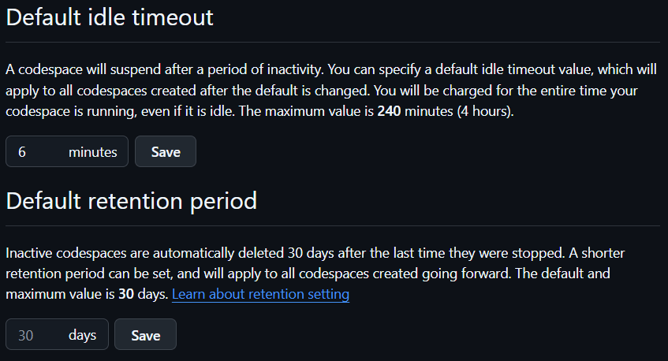
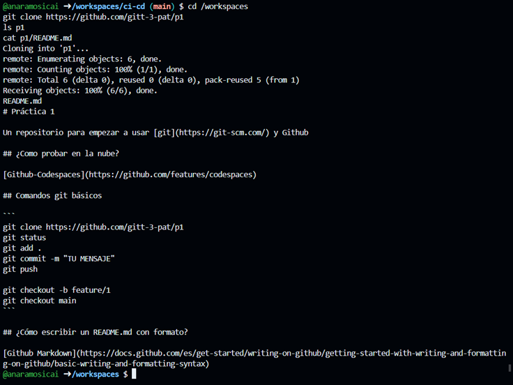
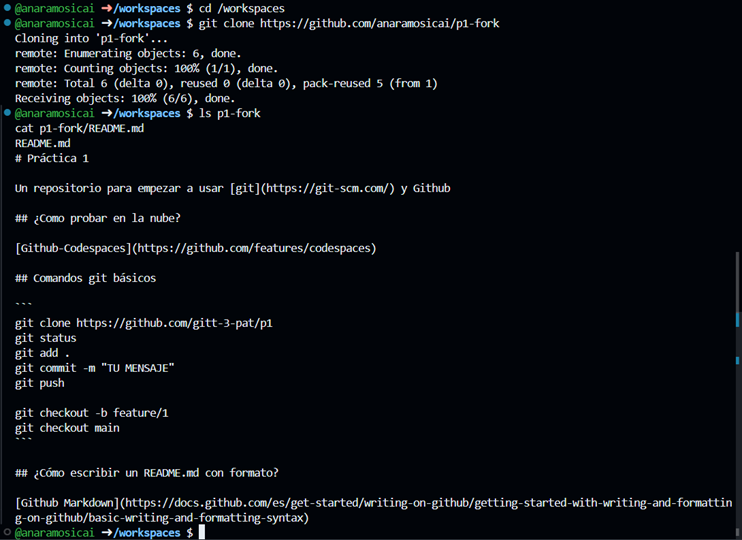
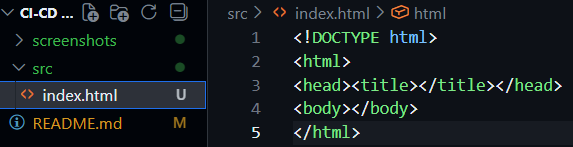

# Práctica 1: Entorno de desarrollo

## 1. Introducción
En esta práctica seguiremos el guión de la introducción a GIT de la asignatura PAT.

## 2. Objetivos
- Preparar el equipo del alumno para poder hacer las futuras prácticas.
- Tener nociones de cómo usar Git y Github.

## 3. Prerrequisitos
- Debemos de tener cuenta en [Github](https://github.com/).
    Esta cuenta será gratuíta y contará con 60h mensuales de uso de Codespaces --> *Entorno de desarrollo en la nube*.
- Comprobar el tiempo de consumo en [Billing](https://github.com/settings/billing) y reducir el tiempo de inactividad dentro de [Codespaces setting](https://github.com/settings/codespaces#default-idle-timeout-header) --> *En mi caso lo he reducido a 6 mins:*




## 4. Repositorio
Será el lugar donde se encuentre el código con la meta-información asociada al histórico de cambios --> *En Github se usará VSC Git*.
### 4.1 Creación repositorio
[Crear un nuevo repositorio](https://github.com/new) público en Github llamado ***ci-cd*** con un fichero README.md .
### 4.2 Creación del Codespace
En el repositorio ci-cd creado, [crearemos un Codespace](https://github.com/codespaces/new). Arrancamos el entorno y escribiremos lo siguiente en la terminal:

```bash
cd /workspaces
git clone https://github.com/gitt-3-pat/p1
ls p1
cat p1/README.md
```
<small>*"clone" coge todo lo que hay en un repositorio y lo clona/copia en otro.*</small>



### 4.3 Realizar un fork
En el repositorio anterior, realizaremos un [fork](https://github.com/gitt-3-pat/p1/fork) con el nombre ***p1-fork***.

<small>*"fork" es una bifurcación, una rama nueva de la rama principal. Se crea una rama diferente. A partir de esta, podemos crear nuevos cambios.*</small>

Escribiremos en la terminal estos pasos:

```bash
cd /workspaces
git clone https://github.com/{usuario}/p1-fork
ls p1-fork
cat p1-fork/README.md
```

***Importante:*** *Sustituir {usuario}* por el nombre de nuestro usuario de Github, en mi caso anaramosicai.



## 5. Ramas
En Git veremos las ramas como una línea de desarrollo independiente del repositorio y son usadas para realizar cambios en Git. La rama inicial la llamaremos ***main*** y los cambios en ramas se realizan en 3 pasos: ***add*** --> ***commit*** --> ***push***.
### 5.1 Creación dir src y fichero index.html
Desde el Codespaces y usando el editor, crearemos un nuevo directorio llamado ***src*** y, a su vez, un fichero llamado ***index.html***. En este, copiaremos las siguientes líneas:

```bash
<!DOCTYPE html>
<html>
<head><title></title></head>
<body></body>
</html>
```



### 5.2 Cambios en la rama
Desde la terminal del Codespace, teclear:

```bash
cd /workspaces/ci-cd
git status
git add .
git commit -m "feat: homepage"
git push origin main
```

## 8. Enlaces útiles
- [Documentación oficial](https://link.com)
- [Recurso 1](https://link.com)