# Introducción a Git/Github

## 1. Introducción
En esta práctica seguiremos el guión de la introducción a GIT de la asignatura PAT.

## 2. Objetivos
- Preparar el equipo del alumno para poder hacer las futuras prácticas.
- Tener nociones de cómo usar Git y Github.

## 3. Prerrequisitos
- Debemos de tener cuenta en [Github](https://github.com/).
    Esta cuenta será gratuíta y contará con 60h mensuales de uso de Codespaces --> *Entorno de desarrollo en la nube*.
- Comprobar el tiempo de consumo en [Billing](https://github.com/settings/billing) y reducir el tiempo de inactividad dentro de [Codespaces setting](https://github.com/settings/codespaces#default-idle-timeout-header) --> *En mi caso lo he reducido a 6 mins:*


## 4. Repositorio
Será el lugar donde se encuentre el código con la meta-información asociada al histórico de cambios --> *En Github se usará VSC Git*.
### 4.1 Creación repositorio
[Crear un nuevo repositorio](https://github.com/new) público en Github llamado `ci-cd` con un fichero README.md .
### 4.2 Creación del Codespace
En el repositorio ci-cd creado, [crearemos un Codespace](https://github.com/codespaces/new). Arrancamos el entorno y escribiremos lo siguiente en la terminal:

```bash
cd /workspaces
git clone https://github.com/gitt-3-pat/p1
ls p1
cat p1/README.md
```
<small>*"clone" coge todo lo que hay en un repositorio y lo clona/copia en otro.*</small>


### 4.3 Realizar un fork
En el repositorio anterior, realizaremos un [fork](https://github.com/gitt-3-pat/p1/fork) con el nombre `p1-fork`.

<small>*"fork" es una bifurcación, una rama nueva de la rama principal. Se crea una rama diferente. A partir de esta, podemos crear nuevos cambios.*</small>

Escribiremos en la terminal estos pasos:

```bash
cd /workspaces
git clone https://github.com/{usuario}/p1-fork
ls p1-fork
cat p1-fork/README.md
```

***Importante:*** *Sustituir {usuario}* por el nombre de nuestro usuario de Github, en mi caso anaramosicai.


## 5. Ramas
En Git veremos las ramas como una línea de desarrollo independiente del repositorio y son usadas para realizar cambios en Git. La rama inicial la llamaremos ***main*** y los cambios en ramas se realizan en 3 pasos: ***add*** --> ***commit*** --> ***push***.
### 5.1 Creación dir src y fichero index.html
Desde el Codespaces y usando el editor, crearemos un nuevo directorio llamado `src` y, a su vez, un fichero llamado `index.html`. En este, copiaremos las siguientes líneas:

```bash
<!DOCTYPE html>
<html>
<head><title></title></head>
<body></body>
</html>
```


### 5.2 Cambios en la rama
Desde la terminal del Codespace, teclear:

```bash
cd /workspaces/ci-cd
git status
git add .
git commit -m "feat: homepage"
git push origin main
```

<small>***Mi interpretación de lo que ha hecho cada comando:***

cd /workspaces/ci-cd  # cambiar de directorio

git status # informa de los cambios no añadidos (add) o actualizados (restore) y de untracked files

git add . # añade el repositorio actual

git commit -m "feat: homepage" # concentra todos los archivos de todos los directorios

git push origin main # actualiza los cambios al main (?)*.</small>

**Comprobación**

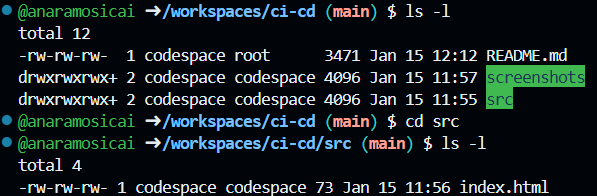

## 6. Git flow
En Git veremos cómo organizar las ramas del repositorio mediante Github-Flow. Propone los siguientes pasos:

 ❶ la rama main siempre tiene el código válido y desplegable

 ❷ los cambios se hacen en ramas nuevas desde main

 ❸ las Pull Requests (PR) permiten solicitar la incorporación de los cambios en main
 
 ❹ tras la revisión de la PR, los cambios se mezclan en main.

1. Desde la terminal ponemos los siguientes comandos:
```bash
cd /workspaces/ci-cd
git checkout -b feat/add-body
```
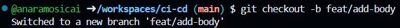

2. Actualizamos el fichero `src/index.html` de la siguiente forma:

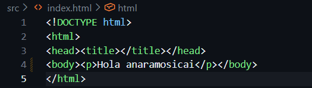

3. Volvemos a la terminal para introducir los siguientes comandos:


4. Procederemos a crear una PR, revisarla y mezclarla:

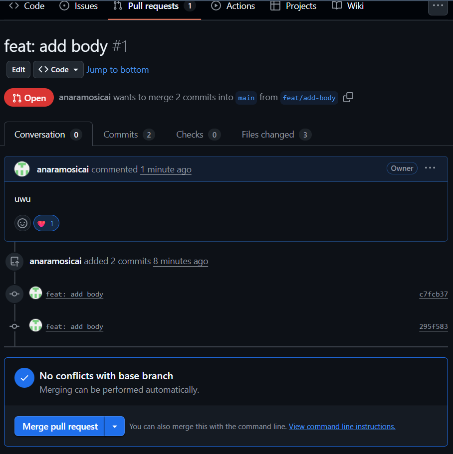
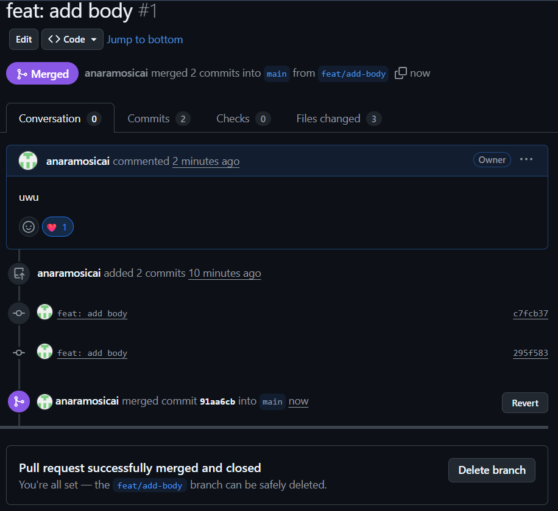

5. Por último, volveremos a la rama main:

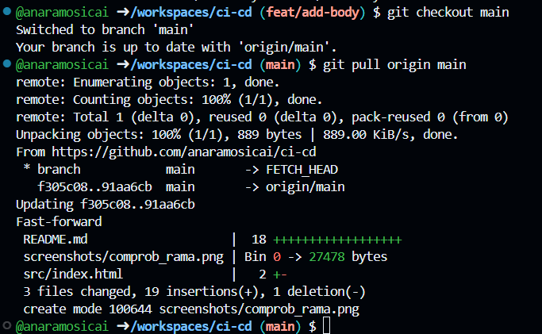


## 7. CI
Intergación continua - CI: Es para que todos los cambios se pasen a un flujo de compilación/pruebas (de forma automáticas), me pase el validador de los pullrequest. 
1º Hará los push de forma automática los archivos y validará los hmtls.
2º Da error: Primero porque falta un título en el html y el lenguaje del mismo

1. Creamos un nuevo workflow llamado `ci.yml` desde Github-Actions del repositorio en el que estamos trabajando.


2. Guardamos los cambios y comprobamos el resultado de la ejecución en las Actions del repositorio.


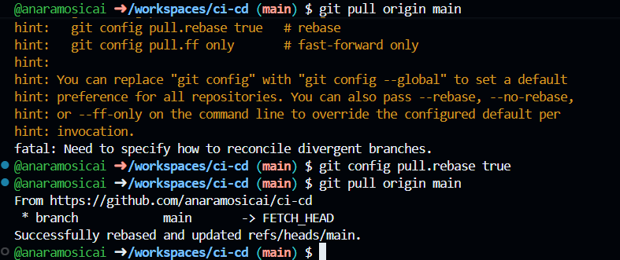

3. Cambiamos el título y el idioma del html:

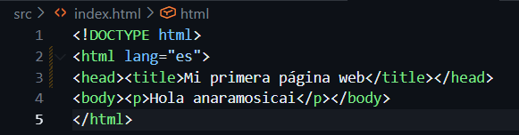

4. Hacemos un push y comprobamos que se ha compilado correctamente en las Actions:

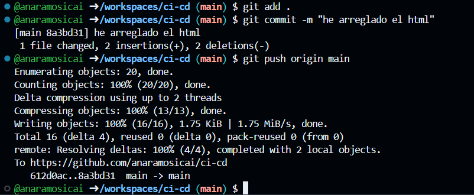
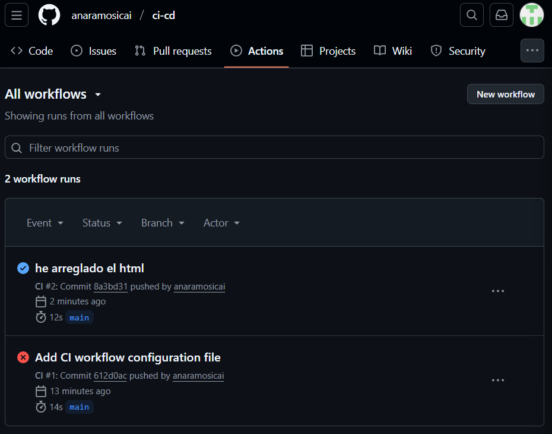


## 8. CD
Despliegue continuo - CD: Es la partición/programa que se encarga de subir los cambios a la página web.

1. Desde la configuración de Github-Pages renombraremos el workflow a `cd.yml` y modifica las siguientes propiedades de su contenido:

`name: CD`

`path: './src'`

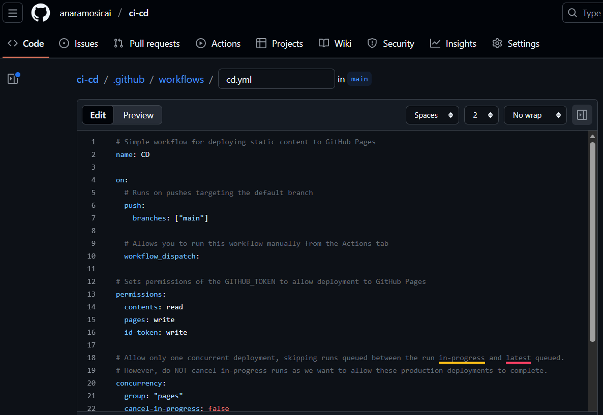
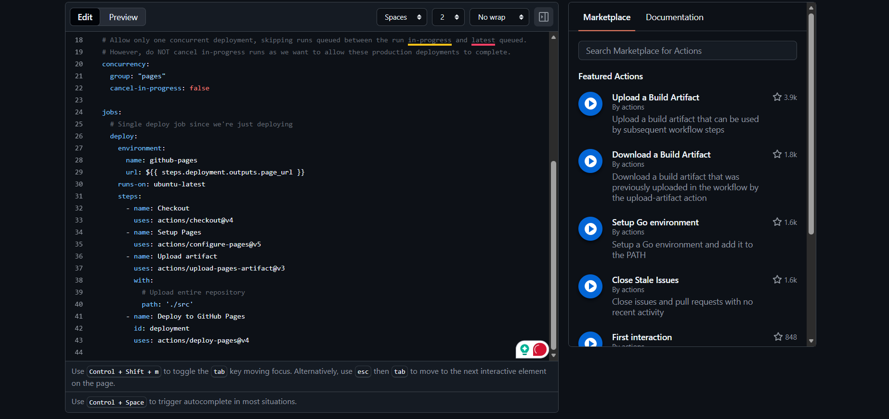

2. Guardaremos y comprobaremos el resultado en Actions:


3. Visualizaremos la página web desde `https://anaramosicai.github.io/ci-cd/`.

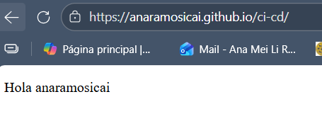


## 9. CI/CD
Combinaremos ambos procesos para automatizar los despliegues de nuevas versiones con la certeza de que no tienen fallos y que, en caso de haberlos, se impida la integración de los cambios y su despliegue.

1. Modificaremos el CI de la siguiente forma:

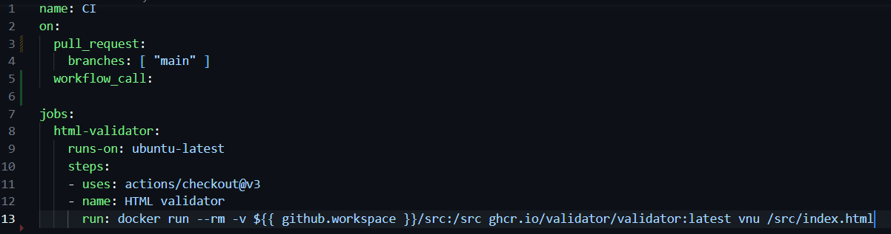

2. También el CD:


3. Subiremos los cambios y los comprobaremos en las Actions del repositorio:

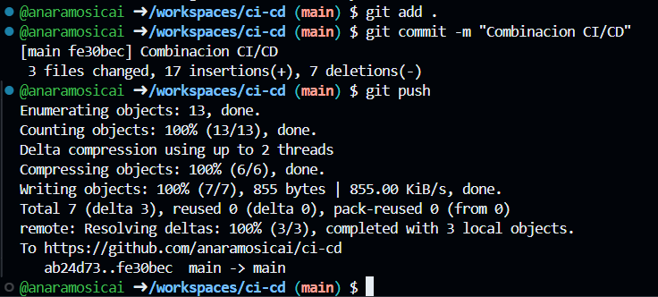


<small>*Tuve un error, pues comenté y luego descomenté todo, incluído el comentario. Lo arreglo en las siguientes capturas de pantalla.*
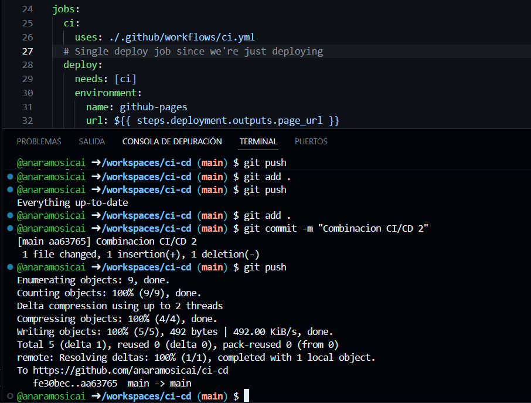
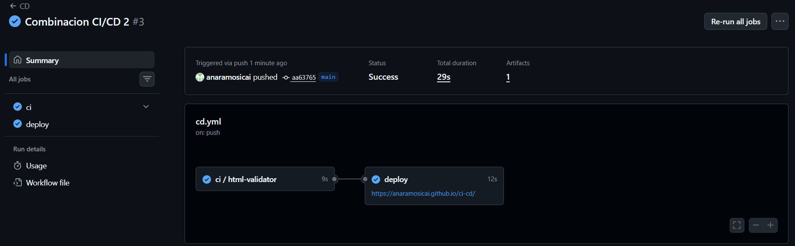
</small>

4. Modificaremos el fichero `./src/index.html` para que la CI se llame. Subiremos los cambios y compraremos el resultado en las Actions del repositorio y en la web desplegada.

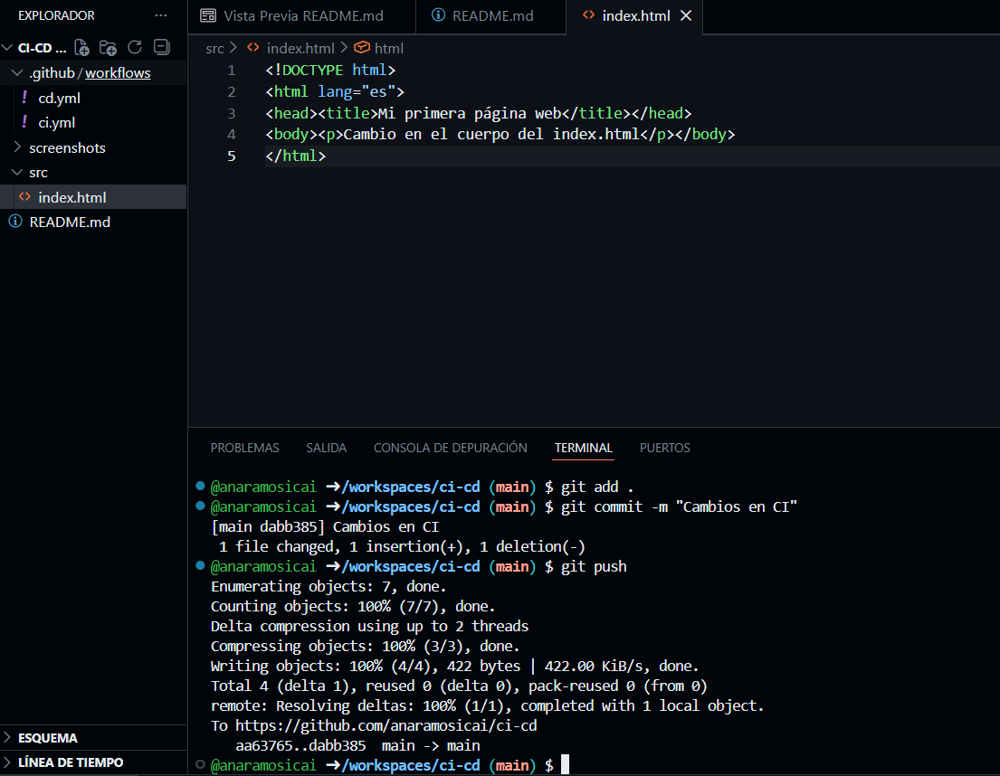

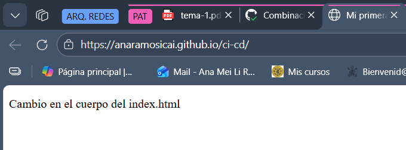


5. Entraremos en las reglas de protección de ramas del repositorio en Github `https://github.com/anaramosicai/ci-cd/settings/branches`)` ➜ "Add rule" y usaremos estos valores:

Branch name pattern: main
☑️ Require a pull request before merging
☑️ Require status checks to pass before merging

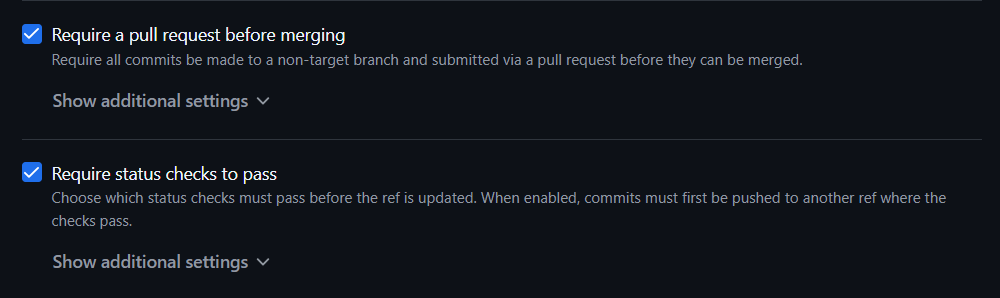


## 10. Enlaces útiles
- [Documentación oficial](https://apicai.github.io/web-ejercicios-pat/intro/git/git.html)